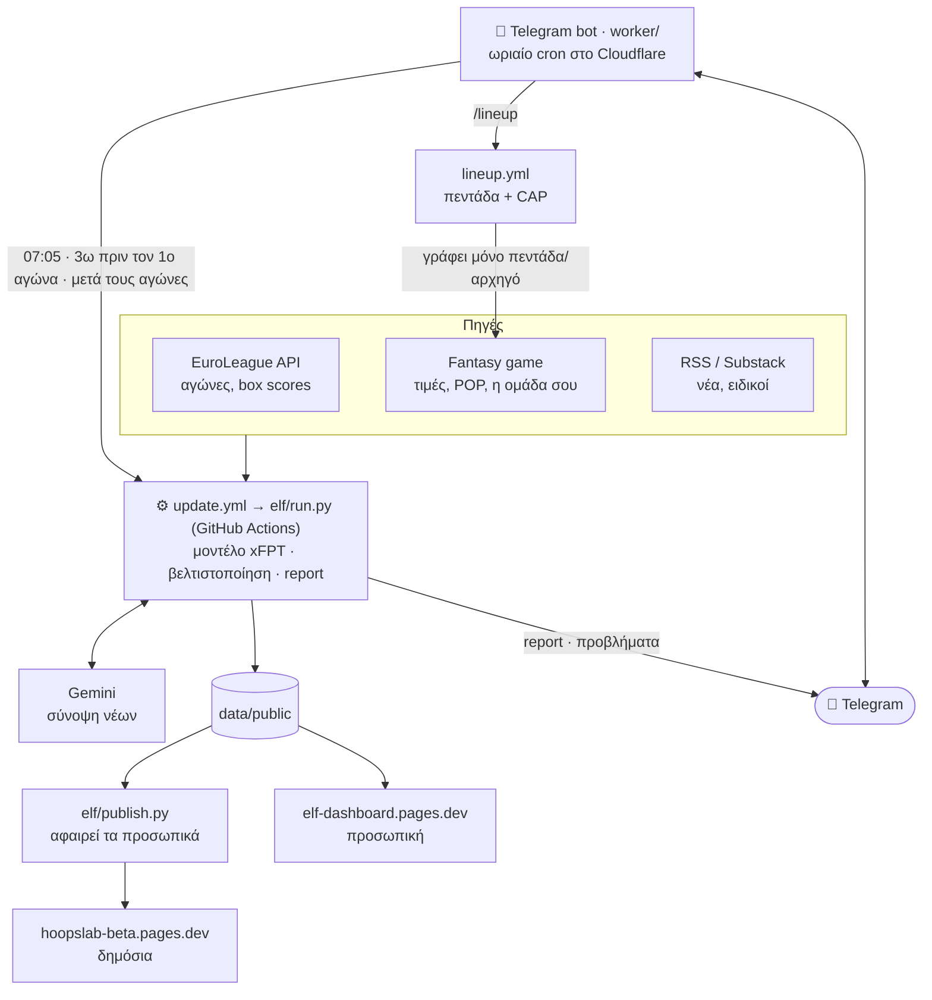
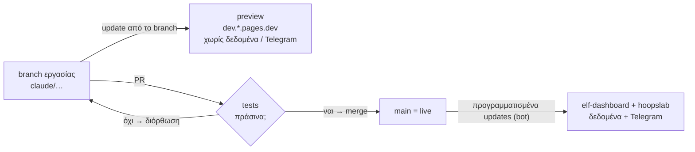

# EuroLeague Fantasy Challenge — helper

Προσωπικό εργαλείο για το [EuroLeague Fantasy Challenge](https://euroleaguefantasy.euroleaguebasketball.net/10):
κατάταξη παικτών με βάση δεδομένα, νέα και γνώμες ειδικών, προτάσεις για αλλαγές και αρχηγό,
ειδοποίηση στο Telegram στις 10:05 κάθε μέρας αγώνων. Κόστος: 0 €.

> **Δημόσια έκδοση:** το σχέδιο προϊόντος (δύο εκδόσεις από το ίδιο engine, συνδρομές, ασφάλεια) βρίσκεται στο [`docs/PRODUCT.md`](docs/PRODUCT.md).
>
> **R&D:** πειράματα βελτίωσης του μοντέλου, μαζί με όσα απέτυχαν, και οι ιδέες σε αναμονή βρίσκονται στο [`research/`](research/README.md).

## Αρχιτεκτονική

Πώς ρέουν τα δεδομένα, από τις πηγές μέχρι το κινητό σου (το GitHub το δείχνει ως διάγραμμα). Εκτός διαγράμματος για να μένει καθαρό: `analytics.yml` (επισκεψιμότητα, 09:05 → Telegram), `functions/feed.js` (proxy όταν ένα Substack μπλοκάρει το GitHub), `tests.yml`.



Πώς περνάει μια αλλαγή στο live (βλ. «Ροή αλλαγών» παρακάτω):



| Κομμάτι | Πού τρέχει | Τι κάνει |
|---|---|---|
| `elf/` (Python) | GitHub Actions (από το bot, 3–4×/μέρα) | στατιστικά EuroLeague, τιμές fantasy, νέα, xPIR, report |
| `web/` | Cloudflare Pages | dashboard (PWA: «Προσθήκη στην αρχική οθόνη» στο iPhone) |
| `worker/` | Cloudflare Workers | ωριαίο cron (update 07:05, report 10:05, update 3 ώρες και έλεγχος 2 ώρες πριν τον 1ο αγώνα, update μετά τους αγώνες) + εντολές bot· ανεβαίνει μόνο του σε κάθε αλλαγή του `worker/` στο `main` |
| `sources.yaml` | — | λίστα πηγών νέων (πρόσθεσε RSS feeds εδώ) |

**Κωδικοί ομάδων:** τα δεδομένα κρατούν τους κωδικούς του API της EuroLeague (IST, MUN, MAD, PAM…)· ό,τι διαβάζει ο χρήστης (site, report, Telegram) δείχνει τους κωδικούς του παιχνιδιού (EFS, BAY, RMB, VBC…), δηλαδή τα «TV codes» του `clubs.json` (`tc()` στο `web/`, `tv()` στο `elf/run.py`).

## Μοντέλο

```
xPIR = base × (1 + calib + pos·pos_dev + pace·pace_dev + margin·m/10 + blowout·|m|/10 + home·h)
```
- **base**: blend PIR τελευταίων 3 / σεζόν / περσινής (DNP μετράει 0).
- **Team rating**: net rating ανά 100 κατοχές + pace + πλεονέκτημα έδρας *ανά ομάδα* (shrinkage).
- **pos_dev**: PIR που δίνει ο αντίπαλος στη θέση του παίκτη vs μέσος όρος.
- **m**: αναμενόμενη διαφορά σκορ (ratings + έδρα) → blowouts κόβουν λεπτά.
- **availability**: από τα νέα (Gemini) — out ×0, doubtful ×0.4, questionable ×0.8.
- **επιστροφή από απουσία**: όποιος δεν έπαιξε σε κανένα από τα 3 τελευταία ματς της ομάδας του → βάση ×0.8 και σήμα «↩ επιστρέφει» (`research/012_injury_return`).
- Τα βάρη **δεν είναι με το μάτι**: `python -m elf.backtest 2025 --save` τα ρυθμίζει με walk-forward backtest.

## Setup (μία φορά)

1. **GitHub Secrets** (Settings → Secrets and variables → Actions):
   `TELEGRAM_BOT_TOKEN`, `GEMINI_API_KEY`, `CLOUDFLARE_API_TOKEN`, `CLOUDFLARE_ACCOUNT_ID`,
   `FANTASY_TOKEN`, και αργότερα `TELEGRAM_CHAT_ID`.
2. Merge στο `main` (τα scheduled workflows τρέχουν μόνο από το default branch).
3. Actions → **Deploy Telegram bot** → Run workflow. Μετά ανεβαίνει μόνο του σε κάθε αλλαγή του `worker/` στο `main`· χειροκίνητα χρειάζεται μόνο όταν αλλάξει κάποιο secret.
4. Στείλε `/start` στο bot → σου απαντά το chat ID → βάλ' το στο secret `TELEGRAM_CHAT_ID`
   → ξανατρέξε το **Deploy Telegram bot**.
5. Actions → **Update data & dashboard** → Run workflow (το πρώτο τρέχει και το backtest).
6. Άνοιξε `https://elf-dashboard.pages.dev` στο Safari → Share → Add to Home Screen.

### Fantasy token
Από υπολογιστή: login στο site → F12 → Network → φίλτρο `dunkest` → refresh →
κλικ σε request προς `fantaking-api.dunkest.com` → Request Headers → `Authorization: Bearer …` →
αντέγραψε ό,τι ακολουθεί το `Bearer ` στο secret `FANTASY_TOKEN`.
- Αν είναι JWT, το pipeline διαβάζει την ημερομηνία λήξης και σε προειδοποιεί **3 μέρες πριν**.
- Αν είναι opaque token, η λήξη φαίνεται μόνο από `401`. Τότε το report και το `/health` το αναφέρουν.
- **Fallback χωρίς token:** αντέγραψε το `my_team.example.yaml` σε `my_team.yaml` με τους 10 παίκτες σου.
  Πρόταση αρχηγού και xPIR της ομάδας δουλεύουν κανονικά. Τιμές και προτάσεις αλλαγών χρειάζονται το token.
- Χρήση: μόνο GET, 3 φορές τη μέρα, για τον δικό σου λογαριασμό. Είναι ανεπίσημο API και μπορεί να αλλάξει χωρίς προειδοποίηση.

### Telegram `/update` (προαιρετικό)
Ξεκινάει το update από το κινητό και σου γράφει όταν τελειώσει.
1. GitHub → Settings (του λογαριασμού) → Developer settings → Personal access tokens →
   **Fine-grained tokens** → Generate new token.
2. Repository access: **Only select repositories** → αυτό το repo.
3. Permissions → Repository permissions → **Actions: Read and write**. Τίποτα άλλο.
4. Expiration: έως το τέλος της σεζόν.
5. Βάλ' το στο secret `GH_DISPATCH_TOKEN` και ξανατρέξε το **Deploy Telegram bot**.

### Πρόγραμμα (ώρα Ελλάδας)
Το GitHub καθυστερεί τα δικά του προγραμματισμένα runs κατά ώρες, γι' αυτό όλο το πρόγραμμα το κρατά το bot (Cloudflare cron):
- **07:05 κάθε μέρα**: update δεδομένων (και για τις δύο εκδόσεις).
- **10:05 σε μέρα αγώνων**: το report στο Telegram, με κουμπί **👥 Πρόταση πεντάδας**.
- **3 ώρες πριν τον 1ο αγώνα της ημέρας**: update, ώστε τραυματισμοί και νέα της ημέρας να φτάσουν στις προτάσεις πριν τη λήξη (βλ. `research/010`).
- **2 ώρες πριν τον 1ο αγώνα της ημέρας**: έλεγχος της ομάδας στο παιχνίδι· μήνυμα **μόνο** αν η πεντάδα
  διαφέρει από την πρόταση (με ✅ Εφάρμοσε) ή αν εκκρεμούν μεταγραφές που πρότεινα (Turn 1).
- **~2,5 ώρες μετά τον τελευταίο αγώνα της ημέρας**: update με τα αποτελέσματα.
- **Προβλήματα** (Gemini, πηγή νέων, token, αποτυχία update) έρχονται στο Telegram μόνο όταν αλλάζουν·
  στη δημόσια έκδοση δεν εμφανίζονται ποτέ.
- Χρειάζεται το `GH_DISPATCH_TOKEN`· χωρίς αυτό δεν γίνονται αυτόματα updates.

### Telegram `/lineup`
Προτείνει πεντάδα, 6ο και αρχηγό από την **πραγματική** σου ομάδα και, αν πατήσεις ✅, τα εφαρμόζει στο παιχνίδι.
- Γράφει **μόνο** πεντάδα/πάγκο/αρχηγό, **ποτέ** μεταγραφές.
- **Κανόνες μέσα στην αγωνιστική** (το παιχνίδι απαντά 422 «Illegal moves» αλλιώς):
  όποιος έχει παίξει μπορεί μόνο να **βγει στον πάγκο** — δεν αλλάζει θέση μέσα στους 6 (π.χ. 6ος → πεντάδα);
  όποιος έπαιξε από τον πάγκο μένει στον πάγκο· το x2 μπορεί να μεταφερθεί μόνο σε παίκτη που δεν έχει παίξει.
- Πεντάδα και 6ος μόνο από παίκτες του τρέχοντος Turn· όσοι παίζουν σε επόμενο Turn μένουν στον πάγκο με πλάνο αλλαγής.
- Πριν γράψει ελέγχει ότι διαβάζει σωστά την ομάδα (formation, σειρά θέσεων). Αν κάτι δεν ταιριάζει ή η πρόταση άλλαξε από τη στιγμή που την είδες, **σταματά χωρίς αλλαγές**.
- Μετά την αποθήκευση ξαναδιαβάζει την ομάδα και επιβεβαιώνει κάθε θέση.
- Χρειάζεται το `GH_DISPATCH_TOKEN` (ίδιο με το `/update`).

### Cloudflare Access (κλείδωμα της προσωπικής σελίδας)
Η `elf-dashboard.pages.dev` δείχνει την ομάδα σου και το report. Με το Access ανοίγει μόνο για σένα (email + κωδικός μίας χρήσης).
Δύο «μηχανές» τη διαβάζουν χωρίς login, με ένα **service token**: το bot (όλα τα δεδομένα του) και το pipeline (το proxy `/feed`).
Η δημόσια σελίδα (HoopsLab) δεν επηρεάζεται.

**Η σειρά μετράει**, αλλιώς σταματά το bot:
1. Cloudflare → **Zero Trust** (δωρεάν έως 50 χρήστες· την πρώτη φορά ζητάει όνομα ομάδας και πλάνο Free).
2. **Access → Service credentials → Service Tokens → Create**: όνομα `elf-bot`, διάρκεια χωρίς λήξη.
   Αντέγραψε **αμέσως** το Client ID και το Client Secret (το secret δεν ξαναφαίνεται).
3. GitHub → Secrets: `CF_ACCESS_CLIENT_ID`, `CF_ACCESS_CLIENT_SECRET`.
4. Actions → **Deploy Telegram bot** → Run workflow (περνάει το token στο bot).
5. **Access → Applications → Add → Self-hosted**:
   - domains `elf-dashboard.pages.dev` **και** `*.elf-dashboard.pages.dev` (τα previews, π.χ. `dev.`)·
   - session duration 1 μήνας (για να μη ζητάει κωδικό συνέχεια το iPhone)·
   - policy 1 — **Allow**, Include → Emails → το email σου·
   - policy 2 — **Service Auth**, Include → Service Token → `elf-bot`.
6. Έλεγχος: άνοιξε τη σελίδα σε ιδιωτικό παράθυρο (πρέπει να ζητήσει email), στείλε `/top` και `/health` στο bot (πρέπει να απαντήσουν κανονικά).
   Αν το bot γράψει «Cloudflare Access 302», το token λείπει ή είναι λάθος: βήματα 3–4.
7. Στο iPhone: άνοιξε μία φορά τη σελίδα από το εικονίδιο και κάνε login· μετά κρατάει για όσο είναι η session duration.

### Στήλες fantasy (ειδικοί)
Στο `sources.yaml` οι πηγές με `fantasy: true` (επίσημα Fantasy Tips, Basketball Sphere, EuroBallin)
διαβάζονται ολόκληρες. Το Gemini καταγράφει ποιον προτείνει κάθε στήλη (pick / captain / avoid).
- Επίδραση στο xFPT **μόνο της τρέχουσας αγωνιστικής**, σκόπιμα μικρή: +5% ανά στήλη (έως 2), +3% αν προτείνεται αρχηγός, −8% αν «avoid», όριο −15%/+13%.
- Κάθε πρόταση γράφεται στο `data/public/expert_log.csv` μαζί με το xFPT του μοντέλου **πριν** την επίδραση — μετά από μερικές αγωνιστικές μετράμε αν οι στήλες προβλέπουν καλύτερα και ρυθμίζουμε τα ποσοστά.
- Παίκτες χωρίς ιστορικό EuroLeague παίρνουν εκτίμηση από την τιμή τους (−20% για την αβεβαιότητα).

### $ — πρόβλεψη ανόδου τιμής
- Μέχρι να υπάρξουν 2 αγωνιστικές τιμών: $ όταν το xFPT ξεπερνά αυτό που «αντιστοιχεί» στην τιμή κατά 3+ πόντους **και** 30%+ (οι φτηνοί ανεβαίνουν πιο εύκολα).
- Μετά: το σύστημα μαθαίνει αυτόματα από το `prices.csv` πώς αλλάζει η τιμή με βάση πόντους και τιμή, και $ σημαίνει προβλεπόμενη άνοδο ≥ +0.3cr (↓$ πτώση).

### Προτιμήσεις (`preferences.yaml`)
`keep`: παίκτες που δεν θέλεις να σου προτείνει να πουλήσεις (π.χ. έχεις άποψη που το μοντέλο δεν ξέρει).
`avoid`: παίκτες που δεν θέλεις να σου προτείνει. Αλλάζεις το αρχείο από το GitHub (✏️) και τρέχεις `/update`.

## Tests
`python -m pytest` (≈30 δευτ., χωρίς δίκτυο — όλα τα εξωτερικά API είναι ψεύτικα). Καλύπτουν:
- κανόνες βελτιστοποίησης: σύνθεση 4G/4F/2C/1HC, budget, ≥1 G/F/C στην πεντάδα, αρχηγός στην πεντάδα,
  πεντάδα μόνο από το τρέχον Turn, κανόνες εντός αγωνιστικής, όριο μεταγραφών, `keep`
- `/lineup` πάνω σε ψεύτικο παιχνίδι: πρόταση → εφαρμογή → επαλήθευση, και ότι **σταματά χωρίς να γράψει**
  σε λάθος formation, άγνωστη διάταξη, παλιά επιβεβαίωση, άρνηση ή μη αποθήκευση από το παιχνίδι
- ολόκληρο το pipeline πάνω στα πραγματικά δεδομένα του repo (έγκυρο JSON χωρίς NaN, νόμιμη ομάδα/μεταγραφές)
- βάρη ορίζοντα/όριο απεριόριστων μεταγραφών, $, στήλες ειδικών, Gemini parsing, token, formations
- το Telegram bot (`worker/`) σε node: μόνο ο ιδιοκτήτης, επιβεβαίωση μία φορά, πρόγραμμα σε ώρα Αθήνας
- οι clients των εξωτερικών API (νέα, Gemini, EuroLeague, Dunkest, Telegram) και ότι τα μηνύματα είναι έγκυρο Telegram HTML
- οι εφεδρικές διαδρομές: Gemini κάτω → προηγούμενη σύνοψη, βελτιστοποίηση που σκάει → απλές μεταγραφές,
  αγωνιστική σε εξέλιξη → κανόνες εντός αγωνιστικής, `my_team.yaml` όταν πέσει το API του παιχνιδιού

Στο CI το coverage του `elf/` δεν πρέπει να πέσει κάτω από το όριο του `.coveragerc` (`python -m pytest --cov`
το δείχνει τοπικά, μαζί με τις γραμμές χωρίς test): νέος κώδικας έρχεται με τα tests του.

Τρέχουν αυτόματα σε κάθε push (workflow **Tests**) και **πριν από κάθε `/lineup` apply**: αν αποτύχουν,
δεν γράφεται τίποτα στο παιχνίδι και έρχεται ❌ στο Telegram.

UI tests (Playwright, PC + iPhone + δύο Android, και οι δύο εκδόσεις): `tests/ui/`, βλ. `tests/ui/README.md`.

## Ροή αλλαγών (main = live)
- **`main`** είναι το live: από εκεί τρέχουν τα προγραμματισμένα updates (το bot ξεκινάει πάντα το default
  branch), γράφονται τα δεδομένα και ανεβαίνουν οι δύο σελίδες.
- **Branch εργασίας** (το `claude/…`): οι αλλαγές ανεβαίνουν εκεί χωρίς αναμονή. Ένα update από αυτό είναι
  **preview**: ανεβαίνει στο `https://dev.elf-dashboard.pages.dev` και στο `https://dev.<δημόσιο project>.pages.dev`,
  δεν γράφει δεδομένα και δεν στέλνει τίποτα στο Telegram.
- Όταν μαζευτούν αλλαγές: **PR προς `main`** → τρέχουν όλα τα tests (Python + UI) → merge μόνο αν είναι πράσινα.
  Με το merge ανεβαίνει μόνο του και το bot, αν άλλαξε το `worker/`· για νέα δεδομένα στο live τρέχει ένα update από το `main`.
- Το `main` προχωράει μόνο του (κάθε update γράφει δεδομένα), οπότε το branch εργασίας συγχρονίζεται με το `main` πριν από κάθε νέα αλλαγή.
- Επείγον (π.χ. λάθος στις μεταγραφές πριν κλείσει η αγωνιστική): μικρή διόρθωση απευθείας στο `main`.

## Τοπικά
```
pip install -r requirements.txt
python -m elf.history 2025 2026     # κατέβασμα ιστορικού
python -m elf.backtest 2025 --save  # ρύθμιση βαρών
python -m elf.run                   # πλήρες pipeline
python -m elf.fantasy dump          # debug: τι επιστρέφει το fantasy API (θέλει FANTASY_TOKEN)
```
