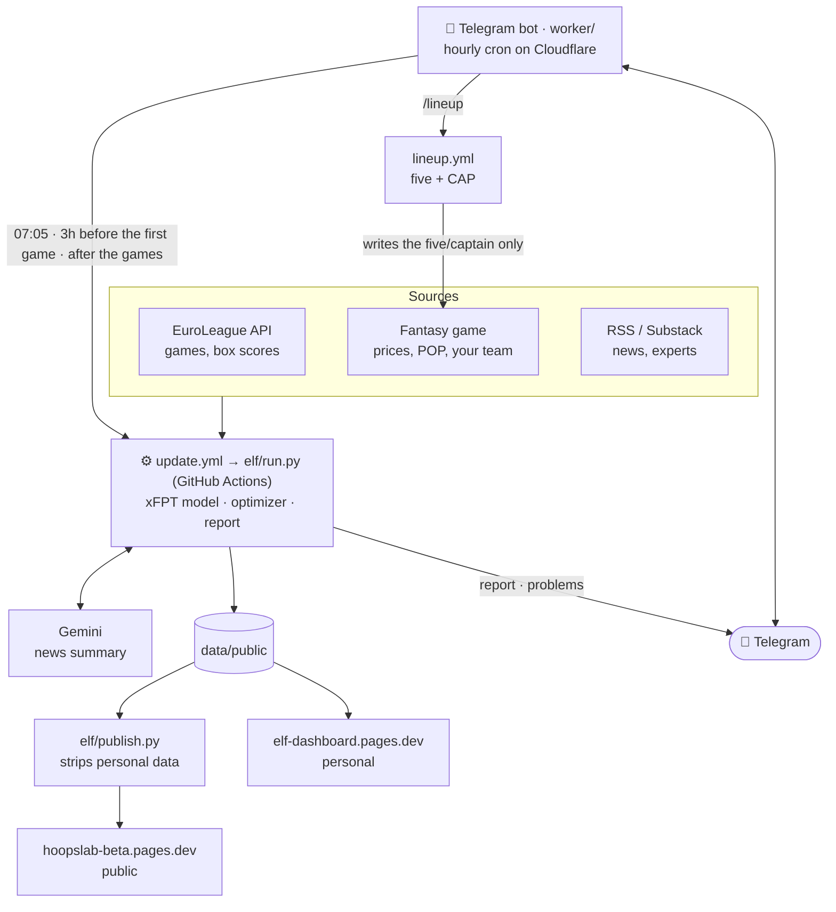
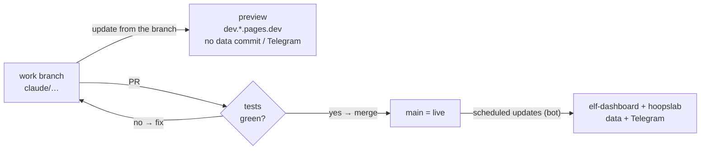

# EuroLeague Fantasy Challenge — helper

A personal tool for the [EuroLeague Fantasy Challenge](https://euroleaguefantasy.euroleaguebasketball.net/10):
a data-driven player ranking built from stats, news and expert opinion, trade and captain suggestions,
and a Telegram report at 10:05 on every game day. Running cost: €0.

> **Public edition:** the product plan (two editions from one engine, subscriptions, security) is in [`docs/PRODUCT.md`](docs/PRODUCT.md).
>
> **R&D:** experiments to improve the model, including the ones that failed, and the ideas on hold are in [`research/`](research/README.md).
>
> **Language:** documentation, code comments and commit messages are in English. Everything a user sees
> (the site, the Telegram bot, the report) is in Greek: the product is for Greek-speaking managers.

## Architecture

How the data flows, from the sources to your phone (GitHub renders it as a diagram). Left out to keep it readable: `analytics.yml` (traffic, 09:05 → Telegram), `functions/feed.js` (a proxy for sites that block GitHub — Substack, BasketNews), `functions/api/sync` (devices in step, see below), `tests.yml`.



How a change reaches live (see «Change flow» below):



| Part | Runs on | What it does |
|---|---|---|
| `elf/` (Python) | GitHub Actions (started by the bot, 3–4×/day) | EuroLeague stats, fantasy prices, news, xPIR, report |
| `web/` | Cloudflare Pages | dashboard (a PWA: «Add to Home Screen» on an iPhone) |
| `functions/` | Cloudflare Pages Functions | `/feed` (news proxy), `/api/sync` (HoopsLab devices in step, D1) |
| `worker/` | Cloudflare Workers | hourly cron (update 07:05, report 10:05, update 3 hours and check 2 hours before the first game, update after the games) + bot commands; deploys itself on every change to `worker/` on `main` |
| `sources.yaml` | — | news sources: RSS feeds, the EuroLeague CMS and pages updated in place (e.g. BasketNews' injury report) |

**Club codes:** the data keep the EuroLeague API's codes (IST, MUN, MAD, PAM…); whatever a user reads (site, report, Telegram) shows the game's codes (EFS, BAY, RMB, VBC…), i.e. the «TV codes» of `clubs.json` (`tc()` in `web/`, `tv()` in `elf/run.py`).

## Model

```
xPIR = base × (1 + calib + pos·pos_dev + pace·pace_dev + margin·m/10 + blowout·|m|/10 + home·h)
```
- **base**: a blend of PIR over the last 3 games / the season / last season (a DNP counts as 0).
- **Team rating**: net rating per 100 possessions + pace + home advantage *per team* (shrunk).
- **pos_dev**: the PIR the opponent concedes to the player's position vs the league average.
- **m**: the expected score margin (ratings + home) → blowouts cut minutes.
- **availability**: from the news (Gemini) — out ×0, doubtful ×0.4, questionable ×0.8.
- **return from absence**: a player who missed all of his team's last 3 games → base ×0.8 and the «↩ returning» flag (`research/012_injury_return`).
- **price as memory**: for players with few games this season, the fantasy price counts as extra games that fade game by game (`research/021_price_prior`).
- The weights are **not set by eye**: `python -m elf.backtest 2025 --save` fits them with a walk-forward backtest.

## Public repo and private data

This repo is **public** (free GitHub Actions, and the work is visible). Everything committed here, and
everything printed in the Actions logs, is visible to anyone. So the data live in two repos:

| Where | What |
|---|---|
| **this repo** (public) | the code and `data/public` **sanitized**: without the owner's team/report/lineups, without article text |
| **`<owner>/elf-data`** (private) | the **full** `data/public` files and the article archive (`archive/`, third-party text) |

The update (`update.yml`) keeps them in step, only when the `DATA_REPO_TOKEN` secret exists
(a fine-grained token for `elf-data` **only**, Contents: read/write):
restore from `elf-data` → pipeline → data check → save to `elf-data` →
sanitize (`python -m elf.publish --repo`) → commit here. The personal site and `/lineup` read the
full files. Without the secret everything stays here, as before (don't remove it: the next update would
write the personal data here again — `tests/test_public_repo.py` would go red).

**Rules for every change:**
- **A new file in `data/public`?** Put it deliberately in one category in `elf/publish.py`:
  `PUBLIC_FILES` (published, with a sanitizing function if it holds anything personal) or `PRIVATE_ONLY`
  (only in `elf-data`). A new `PRIVATE_ONLY` file also goes into the `git rm` of the «Sanitize for the
  public repo» step in `update.yml` **and** into `.gitignore`. `tests/test_public_repo.py` fails if a
  file has no category or if the three lists differ.
- **Nothing personal in the logs:** no `print` of the team, the report, tokens or fantasy API answers
  (`python -m elf.run` prints only how many messages it built; Telegram answers are reduced to «ok» or
  the error by `.github/tg_ok.py`).
- **Article text** only in `elf-data`; here `news.json` keeps title, source, link, date.
- **Test fixtures** (`tests/ui/fixtures/`): fake — team «Demo team», articles without text, the public report.
- The old git history was **not** cleaned (it still holds the article archive and the team from before
  the repo went public): the owner's decision. If it is ever needed: a new repo with `git filter-repo`,
  because in this one the old PRs keep the old commits visible.

## Setup (once)

1. **GitHub Secrets** (Settings → Secrets and variables → Actions):
   `TELEGRAM_BOT_TOKEN`, `GEMINI_API_KEY`, `CLOUDFLARE_API_TOKEN`, `CLOUDFLARE_ACCOUNT_ID`,
   `FANTASY_TOKEN`, `DATA_REPO_TOKEN` (see «Public repo and private data»), and later `TELEGRAM_CHAT_ID`.
2. Merge to `main` (scheduled workflows run from the default branch only).
3. Actions → **Deploy Telegram bot** → Run workflow. After that it deploys itself on every change to `worker/` on `main`; a manual run is needed only when a secret changes.
4. Send `/start` to the bot → it answers with the chat ID → put it in the `TELEGRAM_CHAT_ID` secret
   → run **Deploy Telegram bot** again.
5. Actions → **Update data & dashboard** → Run workflow (the first run also runs the backtest).
6. Open `https://elf-dashboard.pages.dev` in Safari → Share → Add to Home Screen.

### Fantasy token
On a computer: log in to the site → F12 → Network → filter `dunkest` → refresh →
click a request to `fantaking-api.dunkest.com` → Request Headers → `Authorization: Bearer …` →
copy what follows `Bearer ` into the `FANTASY_TOKEN` secret.
- If it is a JWT, the pipeline reads its expiry and warns you **3 days before**.
- If it is an opaque token, expiry shows only as a `401`; the report and `/health` then say so.
- **Fallback without a token:** copy `my_team.example.yaml` to `my_team.yaml` with your players.
  The captain suggestion and the team's xPIR work as usual; prices and trade suggestions need the token.
- Use: GET only, a few times a day, for your own account. It is an unofficial API and can change without notice.

### Telegram `/update` (optional)
Starts an update from your phone and tells you when it is done.
1. GitHub → (account) Settings → Developer settings → Personal access tokens →
   **Fine-grained tokens** → Generate new token.
2. Repository access: **Only select repositories** → this repo.
3. Permissions → Repository permissions → **Actions: Read and write**. Nothing else.
4. Expiration: the end of the season.
5. Put it in the `GH_DISPATCH_TOKEN` secret and run **Deploy Telegram bot** again.

### Schedule (Greek time)
GitHub delays its own scheduled runs by hours, so the whole schedule lives in the bot (Cloudflare cron):
- **07:05 every day**: data update (both editions).
- **10:05 on game days**: the report on Telegram, with a **👥 Πρόταση πεντάδας** (lineup proposal) button.
- **3 hours before the day's first game**: an update, so the day's injuries and news reach the suggestions before the deadline (see `research/010`).
- **2 hours before the day's first game**: a check of the team in the game; a message **only** if the five
  differs from the proposal (with ✅ Apply) or if suggested trades are still pending (Turn 1).
- **~2.5 hours after the day's last game**: an update with the results.
- **Problems** (Gemini, a news source, the token, a failed update) reach Telegram only when they change;
  the public edition never shows them.
- An update you start yourself (`/update`) ends with «✅ Το update ολοκληρώθηκε»; the scheduled ones
  send only the report, problems and failures.
- Needs `GH_DISPATCH_TOKEN`; without it there are no scheduled updates.

### Telegram `/lineup`
Proposes the five, sixth man and captain from your **real** team and, if you press ✅, applies them in the game.
- Writes the five/bench/captain **only**, **never** trades.
- **Rules during a round** (otherwise the game answers 422 «Illegal moves»):
  a player who has played can only **go to the bench** — he can't move within the 6 (e.g. 6th → five);
  a player who played from the bench stays on the bench; the ×2 can only move to a player who hasn't played.
- The five and the sixth man only from players of the current Turn; players of a later Turn stay on the bench with a swap plan.
- Before writing, it checks that it reads the team correctly (formation, order of the places). If anything doesn't match, or the proposal changed since you saw it, it **stops without changes**.
- After saving, it reads the team again and confirms every place.
- Needs `GH_DISPATCH_TOKEN` (same as `/update`).

### Cloudflare Access (locking the personal site)
`elf-dashboard.pages.dev` shows your team and the report. With Access it opens only for you (email + one-time code).
Two «machines» read it without a login, with a **service token**: the bot (all its data) and the pipeline (the `/feed` proxy).
The public site (HoopsLab) is not affected.

**The order matters**, otherwise the bot stops:
1. Cloudflare → **Zero Trust** (free up to 50 users; the first time it asks for a team name and the Free plan).
2. **Access → Service credentials → Service Tokens → Create**: name `elf-bot`, no expiry.
   Copy the Client ID and Client Secret **right away** (the secret is never shown again).
3. GitHub → Secrets: `CF_ACCESS_CLIENT_ID`, `CF_ACCESS_CLIENT_SECRET`.
4. Actions → **Deploy Telegram bot** → Run workflow (passes the token to the bot).
5. **Access → Applications → Add → Self-hosted**:
   - domains `elf-dashboard.pages.dev` **and** `*.elf-dashboard.pages.dev` (the previews, e.g. `dev.`);
   - session duration 1 month (so the iPhone doesn't keep asking for a code);
   - policy 1 — **Allow**, Include → Emails → your email;
   - policy 2 — **Service Auth**, Include → Service Token → `elf-bot`.
6. Check: open the site in a private window (it must ask for an email), send `/top` and `/health` to the bot (they must answer as usual).
   If the bot writes «Cloudflare Access 302», the token is missing or wrong: steps 3–4.
7. On the iPhone: open the site once from the icon and log in; it then holds for the session duration.

### Devices in step (HoopsLab, D1)

A HoopsLab team lives on the device; with a code (⋯ Επιλογές → Συγχρονισμός συσκευών) a PC and a phone
keep the same team. `functions/api/sync/[[path]].js` keeps it in a **Cloudflare D1** database
(table `teams`: code, data, rev, updated_at, user_id — created on the first call; SQL so that it moves
to Supabase/Postgres as it is when accounts come). Once:

1. Cloudflare → Storage & Databases → D1 → Create: `hoopslab-sync` (and, for dev, `hoopslab-sync-dev`).
2. Workers & Pages → `hoopslab-beta` → Settings → Bindings → Add → D1 database: name **`SYNC_DB`**,
   Production → `hoopslab-sync`, Preview → `hoopslab-sync-dev`.
3. A new deploy (the next update) turns it on. Without the database the page says it is «not available yet».

No accounts or personal data: only player ids, prices, credits. Whoever has the code
(12 characters, ~10^17 combinations) sees and changes the team. When both devices change it without a
sync in between, the newer change wins.

### Fantasy columns (experts)
The sources with `fantasy: true` in `sources.yaml` (the official Fantasy Tips, Basketball Sphere, EuroBallin)
are read in full. Gemini records whom each column recommends (pick / captain / avoid); the names are mapped
back to the roster's even when Gemini writes them in Greek (`news.resolve_names`).
- Effect on the xFPT of the **current round only**, deliberately small: +5% per column (up to 2), +3% if suggested as captain, −8% if «avoid», capped at −15%/+13%.
- Every pick is written to `data/public/expert_log.csv` with the model's xFPT **before** the effect — after a few rounds we measure whether the columns predict better and tune the percentages.
- Players without EuroLeague history get an estimate from their price (−20% for the uncertainty).

### $ — price rise prediction
- Until there are 2 rounds of prices: $ when the xFPT beats what the price «implies» by 3+ points **and** 30%+ (cheap players rise more easily).
- After that: the system learns from `prices.csv` how the price moves with points and price, and $ means a predicted rise ≥ +0.3cr (↓$ a fall).

### Preferences (`preferences.yaml`)
`keep`: players you don't want to be told to sell (e.g. you know something the model doesn't).
`avoid`: players you don't want suggested. Edit the file on GitHub (✏️) and run `/update`.

## Tests
`python -m pytest` (≈30 s, no network — every external API is faked). They cover:
- optimizer rules: squad of 4G/4F/2C/1HC, budget, ≥1 G/F/C in the five, captain in the five,
  the five only from the current Turn, in-round rules, trade limit, `keep`, at most 6 per club
- `/lineup` against a fake game: proposal → apply → verify, and that it **stops without writing**
  on a wrong formation, an unknown layout, a stale confirmation, a refusal or a save the game didn't keep
- the whole pipeline on the repo's real data (valid JSON without NaN, a legal team/trades)
- horizon weights / unlimited-trades limit, $, expert columns, Gemini parsing and names, token, formations
- the Telegram bot (`worker/`) in node: owner only, confirm once, schedule in Athens time
- the clients of the external APIs (news, Gemini, EuroLeague, Dunkest, Telegram) and that messages are valid Telegram HTML
- the fallbacks: Gemini down → previous summary, an optimizer crash → simple trades,
  a round under way → in-round rules, `my_team.yaml` when the game's API is down
- the update's data check (`elf/validate.py`: stops before the commit if the day's data are broken)
- the public repo (`tests/test_public_repo.py`): nothing personal or article text in its files, the order
  of the `update.yml` steps, the same list of private files in `publish.py` / `update.yml` / `.gitignore`
- the HoopsLab sync function (`tests/test_sync.py`, in node against an in-memory D1)

In CI the coverage of `elf/` must not drop below the floor in `.coveragerc` (`python -m pytest --cov`
shows it locally, with the lines lacking a test): new code comes with its tests.

They run on every PR, merged with the current main (workflow **Tests**; not again after the merge, nor on
a push without a PR — open the PR as a draft for early checks), and **before every `/lineup` apply**: if they
fail, nothing is written to the game and a ❌ comes on Telegram.

UI tests (Playwright, PC + iPhone + two Androids, both editions): `tests/ui/`, see `tests/ui/README.md`.

## Change flow (main = live)
- **`main`** is live: the scheduled updates run from it (the bot always starts the default
  branch), the data are written and both sites are deployed.
- **Work branch** (`claude/…`): changes are pushed there freely. An update from it is a
  **preview**: it deploys to `https://dev.elf-dashboard.pages.dev` and `https://dev.<public project>.pages.dev`,
  commits no data and sends nothing to Telegram.
- When changes add up: **PR to `main`** → all tests run (Python + UI; UI only if something that reaches
  the dashboard changed) → merge only when green.
  On merge the bot deploys itself if `worker/` changed; for new data on live, run an update from `main`.
- `main` moves on its own (every update commits data), so the work branch syncs with `main` before every new change.
- Urgent (e.g. a wrong trade before the round closes): a small fix straight on `main`.

## Local
```
pip install -r requirements.txt
python -m elf.history 2025 2026     # download history
python -m elf.backtest 2025 --save  # fit the weights
python -m elf.run                   # full pipeline
python -m elf.fantasy dump          # debug: what the fantasy API returns (needs FANTASY_TOKEN)
```
